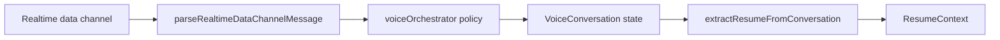

Alright—this is where we turn your idea into an actual **production-grade frontend architecture**, not just screens.

You’re building a **real-time voice product**, so the structure has to optimize for:

* low latency
* clean state flow
* UI clarity
* extensibility

Let’s design it like a serious system.

---

# 🛠 Implementation reality (what the repo actually is today)

For **phased delivery**, routes, database seams, and a consolidated file map, use **[docs/IMPLEMENTATION_PHASES.md](docs/IMPLEMENTATION_PHASES.md)** as the canonical checklist.

The sections below describe the **target architecture**. The current repo is one layer behind that target, and the gap is intentional. To avoid carrying two mental models, this is the ground truth for the codebase right now:

- **App shell**: Vite + React (`src/react/`, `vite.react.config.ts`). No Next.js, no App Router. The `app/` directory and `@/` imports later in this doc are illustrative; in this repo files live under `src/react/...`.
- **Navigation (product shell)** [`src/react/App.tsx`](src/react/App.tsx): primary views are **`landing` → `voice` → `home`** (not the older `form | voice | preview`‑only split). Home combines preview with tabs (overview vs full editor); **Improve role** and **Voice coach** are overlays/modals (`ImproveRoleFlow`, `ResumeVoiceCoach`).
- **State**: `ResumeContext` ([src/react/context/ResumeContext.tsx](src/react/context/ResumeContext.tsx)) owns the resume domain. Voice session UX state largely lives in [VoiceConversation.tsx](src/react/components/VoiceConversation.tsx) (with hooks such as [`useRealtimeVoiceSession`](src/react/hooks/useRealtimeVoiceSession.ts) as helpers). **Zustand is not used** and is deferred until a second consumer of voice state exists.
- **Voice transport (today)**: OpenAI Realtime over **WebRTC + data channel** via [src/react/voice/realtimeSession.ts](src/react/voice/realtimeSession.ts). Mic up, TTS down, JSON events on `oai-events`. **This is not WebSocket.** Do not replace WebRTC with a generic WebSocket client; a typed WebSocket would only be added *alongside* WebRTC if our own backend ever needs to push events.
- **Voice event parsing**: [src/react/voice/voiceOrchestrator.ts](src/react/voice/voiceOrchestrator.ts) holds `parseRealtimeDataChannelMessage`, `transcriptsFromRealtimePayload`, and `assistantTextSuggestsVoiceSessionComplete`. It is policy + parsing, not a global event bus.
- **Orb**: source of truth is `VoiceStatus -> statusToOrbPhase` in [VoiceConversation.tsx](src/react/components/VoiceConversation.tsx). The orb is state-driven, not yet audio-reactive.
- **Voice → resume seam**: transcripts are sent to `POST /extract-resume`, and the resulting resume is fetched via `GET /resume/:sessionId` through [src/react/services/extractResumeFromConversation.ts](src/react/services/extractResumeFromConversation.ts). `ResumeContext.setSessionAndResume` then takes ownership.

## Current event flow



## Optional next steps (not built yet, gated on real product needs)

- **`VoiceContext`** — only when voice state has a second consumer outside `VoiceConversation`.
- **`AudioAnalyzer`** — only when the orb should follow real mic / playback levels instead of `VoiceStatus`.
- **Generic WebSocket client (with reconnect/backoff/session id)** — only when our backend starts pushing events. It would sit *next to* the WebRTC connection, not replace it.
- **Resume pipeline state (`collecting | refining | done`)** — only when that state is needed globally; today it is implicit in `VoiceStatus`.

Treat the rest of this document as the north star. When sections below say Zustand, WebSocket, Next.js paths, or `experiences[]`, read them through this section.

---

# 🧠 0. Tech Stack (locked)

* React + TypeScript
* Zustand (global state)
* WebSocket (real-time events)
* Web Audio API
* Canvas (your orb)

Optional:

* Tailwind (fast styling)

---

# 🧩 1. Project Structure (clean + scalable)

```bash
src/
│
├── app/
│   ├── layout.tsx
│   ├── page.tsx
│
├── components/
│   ├── orb/
│   │   ├── VoiceOrb.tsx
│   │   ├── orbEngine.ts
│   │
│   ├── voice/
│   │   ├── Transcript.tsx
│   │   ├── VoiceControls.tsx
│   │
│   ├── resume/
│   │   ├── ResumePanel.tsx
│   │   ├── ExperienceCard.tsx
│   │
│   ├── ui/
│   │   ├── GlassCard.tsx
│   │   ├── FadeIn.tsx
│
├── store/
│   ├── voiceStore.ts
│   ├── resumeStore.ts
│
├── hooks/
│   ├── useMic.ts
│   ├── useTTS.ts
│   ├── useWebSocket.ts
│
├── lib/
│   ├── audio.ts
│   ├── constants.ts
│
├── styles/
│   ├── globals.css
```

---

# ⚙️ 2. Global State (Zustand)

## Voice Store (core of everything)

```ts
import { create } from "zustand";

type OrbState =
  | "idle"
  | "listening"
  | "capturing"
  | "refining"
  | "responding";

type VoiceState = {
  orbState: OrbState;
  transcript: string;
  isUserSpeaking: boolean;
  isAISpeaking: boolean;

  setOrbState: (s: OrbState) => void;
  setTranscript: (t: string) => void;
};

export const useVoiceStore = create<VoiceState>((set) => ({
  orbState: "idle",
  transcript: "",
  isUserSpeaking: false,
  isAISpeaking: false,

  setOrbState: (s) => set({ orbState: s }),
  setTranscript: (t) => set({ transcript: t }),
}));
```

---

## Resume Store

```ts
type Experience = {
  company?: string;
  role?: string;
  bullets: string[];
};

type ResumeState = {
  experiences: Experience[];
  addExperience: (exp: Experience) => void;
};

export const useResumeStore = create<ResumeState>((set) => ({
  experiences: [],
  addExperience: (exp) =>
    set((s) => ({ experiences: [...s.experiences, exp] })),
}));
```

---

# 🎤 3. Audio Layer (Hooks)

## useMic.ts

```ts
export function useMic() {
  let analyser: AnalyserNode;

  async function init(audioContext: AudioContext) {
    const stream = await navigator.mediaDevices.getUserMedia({ audio: true });
    const source = audioContext.createMediaStreamSource(stream);

    analyser = audioContext.createAnalyser();
    source.connect(analyser);
  }

  function getVolume() {
    const data = new Uint8Array(analyser.frequencyBinCount);
    analyser.getByteFrequencyData(data);
    return data.reduce((a, b) => a + b, 0) / data.length / 255;
  }

  return { init, getVolume };
}
```

---

## useTTS.ts

```ts
export function useTTS() {
  let analyser: AnalyserNode;

  function attachAudio(audioEl: HTMLAudioElement, ctx: AudioContext) {
    const source = ctx.createMediaElementSource(audioEl);
    analyser = ctx.createAnalyser();
    source.connect(analyser);
    analyser.connect(ctx.destination);
  }

  function getVolume() {
    const data = new Uint8Array(analyser.frequencyBinCount);
    analyser.getByteFrequencyData(data);
    return data.reduce((a, b) => a + b, 0) / data.length / 255;
  }

  return { attachAudio, getVolume };
}
```

---

# 🔌 4. WebSocket Layer

## useWebSocket.ts

```ts
export function useWebSocket() {
  const { setTranscript, setOrbState } = useVoiceStore();

  function connect() {
    const ws = new WebSocket("ws://localhost:8000");

    ws.onmessage = (event) => {
      const data = JSON.parse(event.data);

      switch (data.type) {
        case "transcript.partial":
          setTranscript(data.text);
          break;

        case "ai.processing":
          setOrbState("refining");
          break;

        case "ai.response.start":
          setOrbState("responding");
          break;
      }
    };
  }

  return { connect };
}
```

---

# 🧩 5. Main Screen Layout

## page.tsx

```tsx
export default function Home() {
  return (
    <main className="h-screen bg-[#0b0b0f] text-white flex flex-col items-center justify-center">
      <VoiceSection />
    </main>
  );
}
```

---

## VoiceSection.tsx

```tsx
import VoiceOrb from "@/components/orb/VoiceOrb";
import Transcript from "@/components/voice/Transcript";
import ResumePanel from "@/components/resume/ResumePanel";

export default function VoiceSection() {
  return (
    <div className="flex flex-col items-center gap-6">
      <VoiceOrbContainer />
      <Transcript />
      <ResumePanel />
    </div>
  );
}
```

---

# 🎨 6. Orb Container (connect everything)

```tsx
import VoiceOrb from "./VoiceOrb";
import { useMic } from "@/hooks/useMic";
import { useTTS } from "@/hooks/useTTS";
import { useVoiceStore } from "@/store/voiceStore";

export default function VoiceOrbContainer() {
  const { orbState } = useVoiceStore();

  const mic = useMic();
  const tts = useTTS();

  return (
    <VoiceOrb
      state={orbState}
      getInputVolume={mic.getVolume}
      getOutputVolume={tts.getVolume}
    />
  );
}
```

---

# 🧾 7. Transcript Component

```tsx
import { useVoiceStore } from "@/store/voiceStore";

export default function Transcript() {
  const { transcript } = useVoiceStore();

  return (
    <p className="text-lg text-gray-300 max-w-xl text-center">
      {transcript || "Start speaking..."}
    </p>
  );
}
```

---

# 📄 8. Resume Panel

```tsx
import { useResumeStore } from "@/store/resumeStore";

export default function ResumePanel() {
  const { experiences } = useResumeStore();

  if (!experiences.length) return null;

  return (
    <div className="mt-6 w-[400px] bg-white/5 backdrop-blur-lg p-4 rounded-xl border border-white/10">
      {experiences.map((exp, i) => (
        <div key={i}>
          <h3 className="font-semibold">{exp.role}</h3>
          <p className="text-sm text-gray-400">{exp.company}</p>
        </div>
      ))}
    </div>
  );
}
```

---

# 🔁 9. State Flow (end-to-end)

```txt
User speaks
→ mic volume ↑
→ orb = listening

Speech ends
→ orb = capturing

Backend processing
→ orb = refining

TTS starts
→ orb = responding
```

---

# 🧠 10. What makes this “SOTA”

Not the code.

It’s:

* **clean separation of layers**
* **state-driven UI**
* **audio-reactive visuals**
* **real-time updates**

---

# 🚀 What you now have

You now have a **complete frontend architecture**:

* scalable
* real-time ready
* cleanly layered
* aligned with your product vision

---

# 🚀 Next step (high impact)

Pick one:

1. **“connect this to OpenAI realtime”** → full streaming pipeline
2. **“polish UI to production level”** → spacing, motion, micro-interactions
3. **“add follow-up question UX”** → your key differentiator
4. **“optimize orb animation deeply”** → make it feel insane

Tell me which direction and I’ll go deep.
