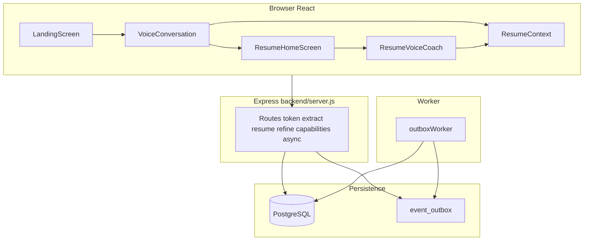

# Implementation phases — shipped vs deferred

This is the **source of truth** for what exists in the repo today versus intentional future work. For subsystem boundaries, see [boundary-map.md](./boundary-map.md). For async failure handling, see [async-failure-playbook.md](./async-failure-playbook.md). For memory/RAG design only (not shipped), see [phase-memory-intelligence.md](./phase-memory-intelligence.md).

### Why we simplified

An MCP-shaped **`toolName` / envelope** layer was explored for agent-style callers. The **browser product** uses ordinary REST (`/refine-employment`, resume CRUD, etc.), so maintaining MCP routes and registry ceremony added complexity without serving shipped UX. The codebase keeps **semantic services**, **Zod validation**, **correlation/logging**, and a **small event outbox + worker** so tradeoffs stay explainable: exploration first, then **prune unused protocol surface** while preserving engineering depth.

---

## Executive summary

The **main React product** lives under [`src/react/`](../src/react/). Navigation is **`landing` → `voice` → `home`** in [`App.tsx`](../src/react/App.tsx): voice intake completes into resume context and switches to the home screen with preview + tabs (overview vs full editor). Overlays include **Improve role** ([`ImproveRoleFlow.tsx`](../src/react/components/ImproveRoleFlow.tsx)) and **Voice coach** ([`ResumeVoiceCoach.tsx`](../src/react/components/ResumeVoiceCoach.tsx)).

Older descriptions that assumed **`form | voice | preview`** only are obsolete—those flows have been folded into landing + home with richer tooling.

**API keys:** OpenAI for Realtime and server-side extraction/refine stays on the server (`OPENAI_API_KEY` in `backend/.env`). The browser receives short-lived tokens via **`GET /token`**. Separate optional client-side Gemini autofill uses `VITE_API_KEY` at build time (see [Autofill](#autofill-separate-stack) below).

**Frontend API base:** HTTP calls default to `http://localhost:8081`. Override with:

```env
VITE_API_BASE_URL=http://localhost:8081
```

(Vite frontend env.)

---

## Phase matrix

| Phase | Name | Status | Primary paths | Notes |
|-------|------|--------|---------------|-------|
| **P1** | Resume core & extraction | **Shipped** | [`backend/server.js`](../backend/server.js): `GET`/`PUT`/`DELETE` `/resume/:sessionId`, `POST /extract-resume`, `POST /import-resume-pdf`, `GET /resume/:sessionId/export`, `GET /resume-schema.json` | PDF upload uses `multipart/form-data` field **`file`**; text-layer PDFs only (see constraints below). |
| **P2** | Realtime voice | **Shipped** | [`realtimeSession.ts`](../src/react/voice/realtimeSession.ts), [`realtimeEvents.ts`](../src/react/voice/realtimeEvents.ts), [`voiceOrchestrator.ts`](../src/react/voice/voiceOrchestrator.ts), [`useRealtimeVoiceSession.ts`](../src/react/hooks/useRealtimeVoiceSession.ts), [`VoiceConversation.tsx`](../src/react/components/VoiceConversation.tsx); `/token` | WebRTC + `oai-events` data channel; not a generic WebSocket voice transport. |
| **P3** | Auth & ownership | **Shipped** | [`backend/auth/supabaseJwt.js`](../backend/auth/supabaseJwt.js), [`backend/auth/ownership.js`](../backend/auth/ownership.js), `POST /link-session`, session-owner middleware on resume routes | Optional Supabase JWT; anonymous flows remain. Schema: `user_id` nullable on snapshots/turns ([`backend/db/schema.sql`](../backend/db/schema.sql)). |
| **P4** | REST capabilities & async jobs | **Shipped (foundation)** | `POST /resume/:sessionId/generate-professional-summary`; [`apps/api/src/schemas/capabilitySchemas.js`](../apps/api/src/schemas/capabilitySchemas.js); [`resumeCapabilitiesService.js`](../apps/api/src/services/resumeCapabilitiesService.js); `GET /async-jobs/:correlationId`; [`backend/repositories/outbox.js`](../backend/repositories/outbox.js); [`services/workers/outboxWorker.js`](../services/workers/outboxWorker.js); [`apps/api/src/observability/`](../apps/api/src/observability/) | Semantic operations stay behind **services + Zod**; outbox worker consumes `event_outbox`. Bullet-level AI edits use **`POST /refine-employment`** (not a duplicate REST name). |
| **P5** | Voice coach & refine UX | **Shipped** | `POST /refine-employment` → [`backend/flows/refineEmployment.js`](../backend/flows/refineEmployment.js); [`refineEmployment.ts`](../src/react/services/refineEmployment.ts); [`ResumeVoiceCoach.tsx`](../src/react/components/ResumeVoiceCoach.tsx); preview apply/reject; [`productMetrics.ts`](../src/react/lib/productMetrics.ts); home flash via `employmentFlashNonce` + [`index.css`](../index.css); [`ResumeHomeScreen.tsx`](../src/react/components/ResumeHomeScreen.tsx) + [`ResumeForm.tsx`](../src/react/components/ResumeForm.tsx) | Intents: `impact`, `ats`, `shorten`, `clarify`; `previewOnly` supported. |
| **Future** | Memory, retrieval, ATS intelligence | **Design only** | [phase-memory-intelligence.md](./phase-memory-intelligence.md) | Embeddings, consolidation workers, JD tailoring, scoring pipelines—not implemented until prioritized. |

Additional routes on the same server include session helpers (`/session/start`, `/session/:sessionId/status`, `/session/:sessionId/update`) and **`GET /health`**.

---

## Architecture sketch



---

## Voice → structured resume (two-step contract)

After the browser captures transcript turns:

1. **`POST /extract-resume`** with the conversation payload → server persists structured resume under a **`sessionId`** (response emphasizes `sessionId`; full resume is not assumed to be inlined in this response path).
2. **`GET /resume/:sessionId`** → load the normalized snapshot into the client.

Client helper: [`extractResumeFromConversation.ts`](../src/react/services/extractResumeFromConversation.ts). Completion can be **automatic** (assistant text matches configured completion phrases) or **manual** (“end and generate”).

---

## PDF import (parallel path)

From landing: upload posts **`POST /import-resume-pdf`** with field name **`file`**. Server uses `pdf-parse` (text-layer PDFs), then shared extraction ([`backend/lib/extractResumeFromText.js`](../backend/lib/extractResumeFromText.js)), stores with `extractionMethod: 'pdf_upload'`, then client **`GET /resume/:sessionId`** and **`setSessionAndResume`** + [`normalizeResumeData.ts`](../src/react/utils/normalizeResumeData.ts).

| Constraint | Typical value |
|------------|----------------|
| Max upload | 5 MB |
| Min extracted text | 40 characters (else `400`; common for scanned PDFs) |
| Text cap before model | 100,000 characters (`MAX_RESUME_SOURCE_CHARS`) |

Scanned/image-only PDFs need future OCR; prefer text export or voice flow.

---

## Resume state & normalization

- **[`ResumeContext.tsx`](../src/react/context/ResumeContext.tsx)** — session id, resume payload, theme/template, persistence (including **localStorage**).
- **[`normalizeResumeData.ts`](../src/react/utils/normalizeResumeData.ts)** — merges loaded/extracted data with defaults from [`resumeSchema.ts`](../src/react/constants/resumeSchema.ts).

Applied on resume load paths including voice and PDF success.

---

## Database schema (operational)

Defined in [`backend/db/schema.sql`](../backend/db/schema.sql):

- **`conversation_turns`** — durable turns keyed by `session_id` + `sequence`.
- **`resume_snapshots`** — versioned JSON payloads per session.
- **`event_outbox`** — async semantic events with correlation ids.
- **`async_job_status`** — projection for debugging/UI polling.

Run migrations via `npm run migrate` in `backend/` (requires `DATABASE_URL`).

---

## Autofill (separate stack)

| Piece | Detail |
|-------|--------|
| UI | [`AiAutofill.tsx`](../src/react/components/form/AiAutofill.tsx) |
| Logic | [`AIService.ts`](../src/react/services/AIService.ts) |
| Model | Google Gemini structured output against resume schema |
| Key | `VITE_API_KEY` at frontend build time |

Voice/refine/extract use **OpenAI on the server**; autofill uses **Gemini in the client bundle** by design today.

---

## Legacy / alternate surfaces

- **Lit widget voice**: [`GdmLiveAudio.tsx`](../src/components/GdmLiveAudio.tsx), [`widget.js`](../widget.js) — can coexist with the React product path.

---

## Known gaps / polish backlog

Not commitments—tracking items that often come next:

- **ImproveRoleFlow vs coach** — align preview-first apply/reject semantics with voice coach where product wants consistency.
- **Autosave vs explicit save** — home editor uses explicit PUT patterns; broader autosave policy not unified everywhere.
- **Observability dashboards** — correlation/logging helpers exist; full dashboards not wired as product UI.
- **Rate limiting, E2E automation** — operational hardening deferred.

---

## Future phase pointer

Longer-horizon orchestration (e.g. LangGraph-style **offline** pipelines next to Realtime) is **not** part of the shipped voice path; any such layer would sit **beside** low-latency Realtime, not inside it. Productized memory/RAG/ATS flows are specified only in [phase-memory-intelligence.md](./phase-memory-intelligence.md) until implemented.

---

## Quick local smoke path

1. **`backend/.env`**: set `OPENAI_API_KEY` (and `DATABASE_URL` / Supabase vars if testing persistence and auth).
2. **`npm start`** in `backend/` (default port **8081**).
3. **`npm run dev`** at repo root for Vite.
4. Landing → voice or PDF upload → home; optional voice coach refine.

For **autofill**, set **`VITE_API_KEY`** for the frontend dev/build environment.

---

## File map — start here

| Area | Files |
|------|--------|
| App navigation | [`App.tsx`](../src/react/App.tsx), [`LandingScreen.tsx`](../src/react/components/LandingScreen.tsx), [`ResumeHomeScreen.tsx`](../src/react/components/ResumeHomeScreen.tsx) |
| Voice | [`VoiceConversation.tsx`](../src/react/components/VoiceConversation.tsx), [`src/react/voice/`](../src/react/voice/), [`useRealtimeVoiceSession.ts`](../src/react/hooks/useRealtimeVoiceSession.ts) |
| Coach / refine | [`ResumeVoiceCoach.tsx`](../src/react/components/ResumeVoiceCoach.tsx), [`refineEmployment.ts`](../src/react/services/refineEmployment.ts), [`backend/flows/refineEmployment.js`](../backend/flows/refineEmployment.js) |
| Resume domain state | [`ResumeContext.tsx`](../src/react/context/ResumeContext.tsx), [`normalizeResumeData.ts`](../src/react/utils/normalizeResumeData.ts) |
| Resume templates / rendering | [`src/react/resume-engine/`](../src/react/resume-engine/), [`ResumePreview.tsx`](../src/react/components/ResumePreview.tsx), [`templates/`](../src/react/components/templates/) (includes **Simple (ATS)** [`AtsFriendlyTemplate.tsx`](../src/react/components/templates/AtsFriendlyTemplate.tsx)); layout picker on [`ResumeHomeScreen`](../src/react/components/ResumeHomeScreen.tsx) |
| Backend HTTP surface | [`server.js`](../backend/server.js) |
| Capabilities & validation | [`capabilitySchemas.js`](../apps/api/src/schemas/capabilitySchemas.js), [`resumeCapabilitiesService.js`](../apps/api/src/services/resumeCapabilitiesService.js) |
| Outbox / worker | [`outbox.js`](../backend/repositories/outbox.js), [`outboxWorker.js`](../services/workers/outboxWorker.js) |
| Domain snippet | [`packages/domain/src/resume/summary.js`](../packages/domain/src/resume/summary.js) |
