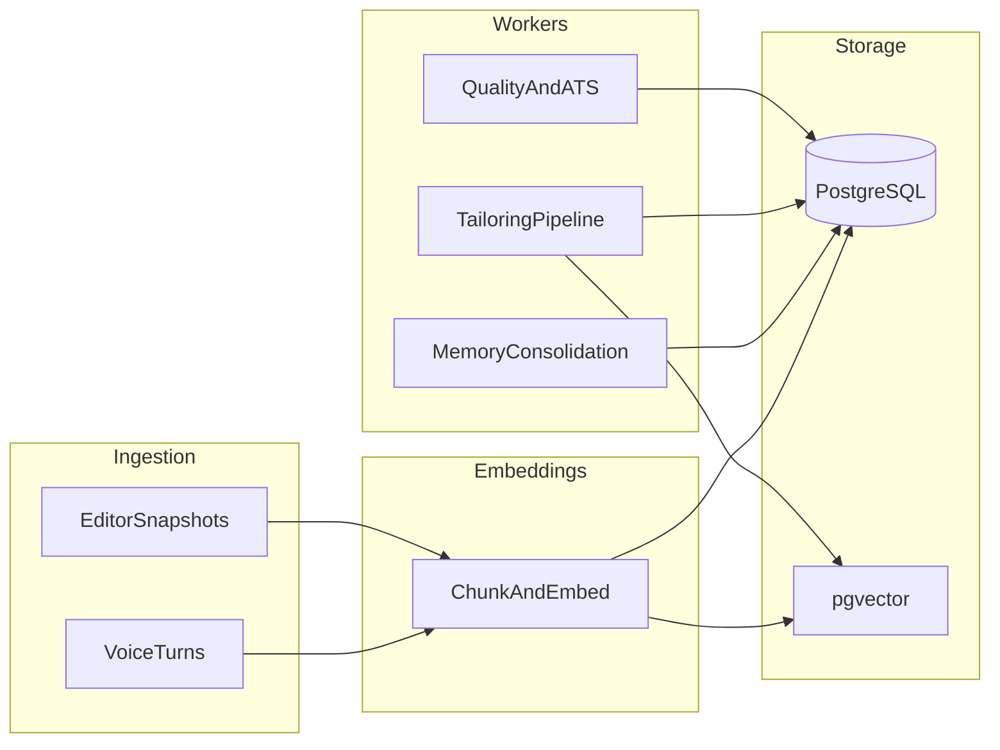

# Phase — Knowledge, Memory & Resume Intelligence (Design)

This document captures the **next-phase** plan after the realtime voice + collaborative editing loop is stable.  
No implementation commitment until core product metrics show healthy engagement.

## Goals

1. **Reusable career memory** — skills, projects, and roles normalized once and reused across tailoring.
2. **Retrieval-augmented suggestions** — voice and editor surfaces pull the right evidence for the target role.
3. **Explainable resume intelligence** — ATS fit, impact clarity, and tailoring quality users can trust.

## Architecture Sketch

## Data Model (Draft)

| Entity | Purpose |
|--------|---------|
| `canonical_skill` | Deduped skill string + aliases |
| `experience_fact` | Structured bullets tied to employment IDs |
| `project_embedding` | Vector + metadata for retrieval |
| `user_memory_summary` | Rolling narrative summary (optional) |

## Retrieval Contracts

- **Input:** target role title, optional job description snippet, session resume snapshot ID.
- **Output:** ranked chunks (projects, bullets, skills) with scores and citation IDs for UI.

## Worker Responsibilities

1. **Consolidation** — merge duplicate skills; normalize employers/titles; attach embeddings after stable text.
2. **Tailoring** — job-description-conditioned rewrite using retrieved chunks (async; not on critical voice path).
3. **Scoring** — ATS keyword coverage + readability heuristics; returns actionable checklist.

## UX Hooks

- Inline “why this suggestion?” with source citations from retrieval.
- Async badge when tailoring/scoring runs (reuse `/async-jobs/:correlationId` pattern).

## Exit Criteria Before Building

- Core voice loop: stable latency + interruption metrics from `productMetrics`.
- ≥70% of test sessions complete primary refine flow without errors (manual QA rubric).
- Editor refresh correctness validated across authenticated + anonymous sessions.

## Risks

- Premature embedding cost — start with on-demand embedding for changed sections only.
- Memory drift — schedule periodic consolidation and user-visible “memory review” later.

## References

- Async playbook: [async-failure-playbook.md](./async-failure-playbook.md)
- Boundary map: [boundary-map.md](./boundary-map.md)
